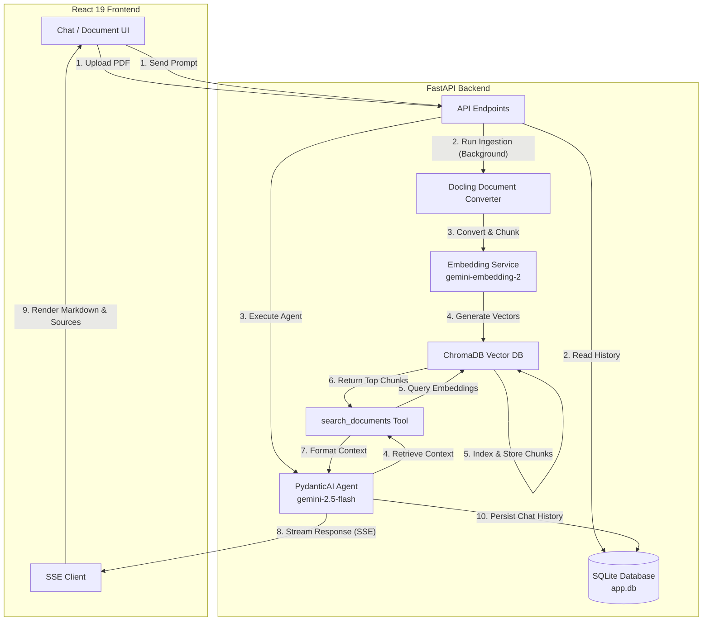

# 🔍 Hybrid RAG Chatbot

An enterprise-grade, agent-driven Retrieval-Augmented Generation (RAG) application. This repository contains a complete full-stack implementation featuring an **agentic chat service** powered by **PydanticAI**, real-time **PDF ingestion** using **Docling**, and a fast, modern **React 19** frontend.

---

## 🏗️ System Architecture & Data Flow

The architecture is divided into two primary flows: **Document Ingestion** and **Chat Querying**.



### 1. Ingestion Pipeline
* **Document Extraction:** Uses **Docling** for high-fidelity extraction of PDF layouts and tabular data.
* **Hybrid Chunking:** Splits documents into semantically coherent text segments (up to 512 tokens).
* **Vector Embeddings:** Computes high-dimensional representations using the Google GenAI `gemini-embedding-2` model.
* **Storage:** Indexes the generated embeddings and source metadata inside **ChromaDB**.

### 2. Conversation & RAG Query Pipeline
* **State Management:** Conversation histories and message roles are persisted in **SQLite** via **SQLAlchemy**.
* **Agentic Orchestration:** A **PydanticAI** agent uses `gemini-2.5-flash` to reason about user prompts, search context using custom tools, and formulate streaming answers.
* **Real-time Delivery:** Responses stream back to the UI token-by-token using Server-Sent Events (SSE).

---

## ⚡ Key Features

* **High-Fidelity PDF Parsing:** Accurate rendering and conversion of multi-column papers and complex tables using Docling.
* **Agent-in-the-Loop Retrieval:** Built-in `search_documents` tool allows the LLM to search ChromaDB and fetch context dynamically only when needed.
* **Live Streaming Interface:** Smooth, markdown-rendered streaming responses with real-time UI updates.
* **Source Attribution:** Shows exact metadata (source document filename, chunk indexes) used to formulate the AI response.
* **Robust DB Layer:** Full async database operations using SQLite + `aiosqlite` + SQLAlchemy.

---

## 📁 Repository Structure

```
hybrid-rag/
├── README.md                 # Project-wide documentation
├── rag_backend/             # Python FastAPI Backend
│   ├── chromadb/            # Persisted ChromaDB Vector store
│   ├── docs/                # Saved source PDF files
│   ├── models/              # SQLAlchemy DB Models
│   ├── routes/              # FastAPI Router Controllers
│   ├── schemas/             # Pydantic validation schemas
│   ├── services/            # Core business logic (Agent, Ingestion, Embeddings)
│   ├── app.db               # SQLite database file
│   ├── db.py                # Database engine setup
│   ├── main.py              # Application entrypoint
│   └── pyproject.toml       # Python package configuration
└── rag-frontend/            # React + TypeScript Frontend
    ├── src/
    │   ├── components/      # UI components (chat inputs, messages, etc.)
    │   ├── pages/           # Page structures (Chat, Library)
    │   ├── services/        # API integration clients (SSE streams)
    │   ├── index.css        # Tailwind/CSS configurations
    │   └── App.tsx          # Application entry and routing
    ├── package.json         # Frontend configuration
    └── vite.config.ts       # Vite config (Tailwind 4 setup)
```

---

## 🛠️ Backend Setup & Installation

### Prerequisites
* Python `3.13` or higher
* [uv](https://github.com/astral-sh/uv) (recommended Python package manager)
* Gemini API Key

### Setup Instructions

1. **Navigate to the backend directory:**
   ```bash
   cd rag_backend
   ```

2. **Create the environment variables file (`.env`):**
   ```env
   GEMINI_API_KEY=your_gemini_api_key_here
   DATABASE_URL=sqlite+aiosqlite:///./app.db
   ```

3. **Install dependencies and launch the dev server:**
   Using `uv`, run:
   ```bash
   uv run fastapi dev
   ```
   This will set up a virtual environment, install the dependencies listed in `pyproject.toml`, execute database migrations (auto-creating SQLAlchemy tables on startup), and run the FastAPI server at `http://127.0.0.1:8000`.

---

## 💻 Frontend Setup & Installation

### Prerequisites
* Node.js `18+`
* npm / pnpm

### Setup Instructions

1. **Navigate to the frontend directory:**
   ```bash
   cd rag-frontend
   ```

2. **Install dependencies:**
   ```bash
   npm install
   ```

3. **Run the Vite development server:**
   ```bash
   npm run dev
   ```
   Open `http://localhost:5173` in your browser to access the web application.

---

## 🔌 API Endpoints Summary

| Method | Endpoint | Description |
| :--- | :--- | :--- |
| `GET` | `/doc/` | Lists all uploaded source documents. |
| `POST` | `/doc/upload` | Uploads a PDF file and triggers background ingestion. |
| `POST` | `/chat/` | Sends a prompt to the agent and gets a static response. |
| `POST` | `/chat/stream` | Streams agent responses with Server-Sent Events (SSE). |
| `GET` | `/conversations/list` | Returns all active conversation threads. |
| `DELETE` | `/conversations/{id}` | Deletes a conversation thread and its message history. |

---

## 📚 Usage Workflow

1. **Upload Documents**: Navigate to the Library tab, upload a PDF (e.g. academic papers or technical documentation).
2. **Ingestion Running**: The backend ingests the file asynchronously. Check the terminal logs to see Docling and ChromaDB indexing complete.
3. **Start Chatting**: Open the Chat tab, start a new thread, and ask questions. The AI will retrieve the most relevant sections of your uploaded document and cite its sources directly.
