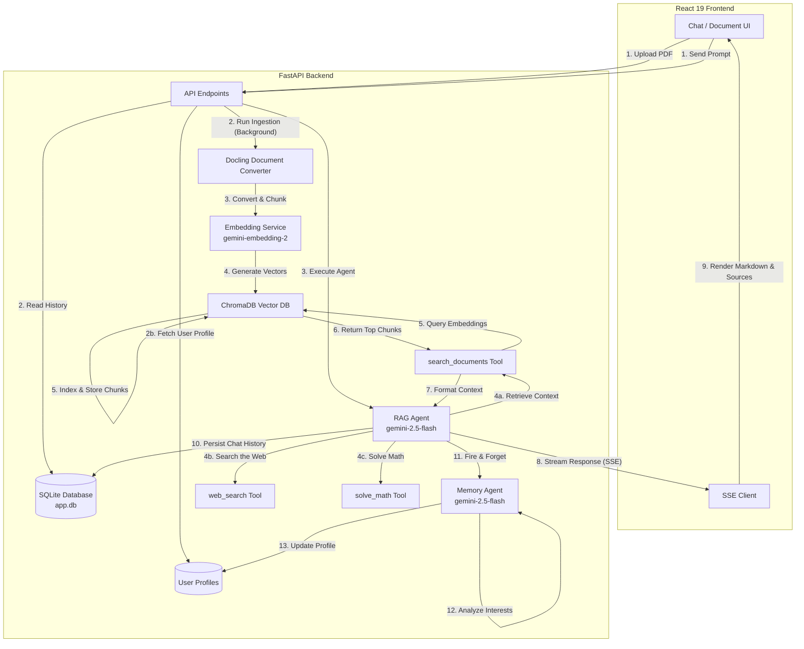

# 🔍 Hybrid RAG Chatbot

An enterprise-grade, **multi-agent** Retrieval-Augmented Generation (RAG) application. This repository contains a complete full-stack implementation featuring an **agentic chat service** powered by **PydanticAI**, persistent **user memory** via a dedicated **Memory Agent**, real-time **PDF ingestion** using **Docling**, and a fast, modern **React 19** frontend.

---


## 🏗️ System Architecture & Data Flow

The architecture is divided into three primary flows: **Document Ingestion**, **Chat Querying**, and **Memory Profiling**.



### 1. Ingestion Pipeline
* **Document Extraction:** Uses **Docling** for high-fidelity extraction of PDF layouts and tabular data.
* **Hybrid Chunking:** Splits documents into semantically coherent text segments (up to 512 tokens).
* **Vector Embeddings:** Computes high-dimensional representations using the Google GenAI `gemini-embedding-2` model (512 dimensions).
* **Storage:** Indexes the generated embeddings and source metadata inside **ChromaDB**.

### 2. Conversation & RAG Query Pipeline
* **State Management:** Conversation histories and message roles are persisted in **SQLite** via **SQLAlchemy**.
* **Agentic Orchestration:** A **PydanticAI** RAG agent uses `gemini-2.5-flash` to reason about user prompts, dynamically invoking one of three tools:
  * `search_documents` — retrieves relevant chunks from ChromaDB.
  * `web_search` — searches the live web via DuckDuckGo for up-to-date information.
  * `solve_math` — symbolically solves mathematical expressions using SymPy.
* **Personalized Responses:** The user's profile (interests & preferences) is injected into the system prompt, allowing the agent to tailor answers.
* **Real-time Delivery:** Responses stream back to the UI token-by-token using Server-Sent Events (SSE), including tool-call status events.

### 3. Memory Agent (Persistent User Profiling)
* **Background Profiling:** After every conversation turn, a fire-and-forget background task runs a dedicated **Memory Agent** (`gemini-2.5-flash`) to analyze the exchange.
* **Interest Extraction:** The Memory Agent extracts new user interests (e.g. topics, technologies) and preferences (e.g. communication style, coding guidelines) — only novel traits not already in the profile.
* **Profile Persistence:** Extracted traits are merged, deduplicated, and stored in the `user_profiles` table in SQLite, building a progressively richer user profile over time.
* **Adaptive Personalization:** On subsequent conversations, the RAG agent reads the stored profile and adapts its system prompt for more relevant and personalized answers.

---

## ⚡ Key Features

* **Multi-Agent Architecture:** Dedicated RAG Agent for answering questions and a Memory Agent for building user profiles — each with their own PydanticAI agent instance.
* **High-Fidelity PDF Parsing:** Accurate rendering and conversion of multi-column papers and complex tables using Docling.
* **3 Agent Tools:** The RAG agent can search documents, search the web, and solve math problems — choosing the right tool dynamically.
* **Persistent User Memory:** The system learns and remembers user interests and preferences across sessions, adapting responses over time.
* **Live Streaming Interface:** Smooth, markdown-rendered streaming responses with real-time tool-call indicators and UI updates.
* **Source Attribution:** Shows exact metadata (source document filename, chunk indexes) used to formulate the AI response.
* **Robust Async DB Layer:** Full async database operations using SQLite + `aiosqlite` + SQLAlchemy with background session management.

---

## 📁 Repository Structure

```
hybrid-rag/
├── README.md                       # Project-wide documentation
├── rag_backend/                    # Python FastAPI Backend
│   ├── chromadb/                   # Persisted ChromaDB Vector store
│   ├── docs/                       # Saved source PDF files
│   ├── models/                     # SQLAlchemy DB Models
│   │   ├── base.py                 # Declarative base
│   │   ├── conversations.py        # Conversation model
│   │   ├── message.py              # Message model (with metadata)
│   │   └── user_profile.py         # UserProfile model (interests, preferences)
│   ├── routes/                     # FastAPI Router Controllers
│   │   ├── chat.py                 # Chat & streaming endpoints
│   │   ├── conversation.py         # Conversation CRUD endpoints
│   │   └── documents.py            # Document upload & chunk retrieval
│   ├── schemas/                    # Pydantic validation schemas
│   │   ├── chat.py                 # Chat request schema
│   │   ├── title_update.py         # Conversation title update schema
│   │   └── user_profile_update.py  # Memory Agent structured output schema
│   ├── services/                   # Core business logic
│   │   ├── agent_service.py        # RAG Agent (search, web, math tools)
│   │   ├── chat_service.py         # Chat orchestration & memory integration
│   │   ├── embedding_service.py    # Google GenAI embedding service
│   │   ├── ingestion_service.py    # Docling PDF ingestion pipeline
│   │   └── memory_agent_service.py # Memory Agent for user profiling
│   ├── app.db                      # SQLite database file
│   ├── db.py                       # Database & ChromaDB engine setup
│   ├── main.py                     # Application entrypoint
│   └── pyproject.toml              # Python package configuration (uv)
└── rag-frontend/                   # React + TypeScript Frontend (Vite)
    ├── src/
    │   ├── components/
    │   │   ├── chat/               # ChatInput, ChatMessage, CodeBlock,
    │   │   │                       # RiskCard, SourceBadge, ThinkingIndicator
    │   │   ├── home/               # HeroSection
    │   │   ├── layout/             # SideNavBar, TopAppBar
    │   │   ├── library/            # FileItem, FileLibraryModal
    │   │   └── icons/              # Icon components
    │   ├── hooks/                  # Custom React hooks
    │   │   ├── useChat.ts          # Chat streaming & message state
    │   │   ├── useConversations.ts # Conversation CRUD management
    │   │   └── useDocuments.ts     # Document upload & listing
    │   ├── pages/                  # Page components
    │   │   ├── ChatPage.tsx        # Main chat interface
    │   │   └── HomePage.tsx        # Landing / home page
    │   ├── services/
    │   │   └── api.ts              # API integration client (SSE streams)
    │   ├── types/
    │   │   └── types.ts            # TypeScript type definitions
    │   ├── index.css               # Tailwind CSS v4 styles
    │   └── App.tsx                 # Application entry and routing
    ├── package.json                # Frontend configuration
    └── vite.config.ts              # Vite config (Tailwind 4 setup)
```

---

## 🛠️ Backend Setup & Installation

### Prerequisites
* Python `3.13` or higher
* [uv](https://github.com/astral-sh/uv) (recommended Python package manager)
* Gemini API Key

### Setup Instructions

1. **Navigate to the backend directory:**
   ```bash
   cd rag_backend
   ```

2. **Create the environment variables file (`.env`):**
   ```env
   GEMINI_API_KEY=your_gemini_api_key_here
   DATABASE_URL=sqlite+aiosqlite:///./app.db
   ```

3. **Install dependencies and launch the dev server:**
   Using `uv`, run:
   ```bash
   uv run fastapi dev
   ```
   This will set up a virtual environment, install the dependencies listed in `pyproject.toml`, execute database migrations (auto-creating SQLAlchemy tables on startup — including `user_profiles`), and run the FastAPI server at `http://127.0.0.1:8000`.

---

## 💻 Frontend Setup & Installation

### Prerequisites
* Node.js `18+`
* npm / pnpm

### Setup Instructions

1. **Navigate to the frontend directory:**
   ```bash
   cd rag-frontend
   ```

2. **Install dependencies:**
   ```bash
   npm install
   ```

3. **Run the Vite development server:**
   ```bash
   npm run dev
   ```
   Open `http://localhost:5173` in your browser to access the web application.

---

## 🔌 API Endpoints Summary

| Method | Endpoint | Description |
| :--- | :--- | :--- |
| `GET` | `/doc/` | Lists all uploaded source documents. |
| `POST` | `/doc/upload` | Uploads a PDF file and triggers background ingestion. |
| `GET` | `/doc/chunks/{chunk_id}` | Fetches a single chunk's text and metadata by its ChromaDB ID. |
| `POST` | `/chat/` | Sends a prompt to the agent and gets a static response. |
| `POST` | `/chat/stream` | Streams agent responses with Server-Sent Events (SSE). |
| `GET` | `/conversations/list` | Returns all active conversation threads. |
| `POST` | `/conversations/new` | Creates a new conversation thread. |
| `GET` | `/conversations/{id}` | Retrieves a conversation with its full message history. |
| `DELETE` | `/conversations/{id}` | Deletes a conversation thread and its message history. |
| `PATCH` | `/conversations/{id}/title` | Updates the title of a conversation thread. |

---

## 🧠 Tech Stack

| Layer | Technology |
| :--- | :--- |
| **LLM** | Google Gemini 2.5 Flash (via PydanticAI) |
| **Embeddings** | Google Gemini Embedding 2 (512-dim) |
| **Agent Framework** | PydanticAI |
| **Vector Store** | ChromaDB (persistent) |
| **Document Parsing** | Docling (PDF, tables) |
| **Web Search** | DuckDuckGo (ddgs) |
| **Math Solver** | SymPy |
| **Backend** | FastAPI (async) |
| **Database** | SQLite + aiosqlite + SQLAlchemy |
| **Frontend** | React 19, TypeScript, Vite |
| **Styling** | Tailwind CSS v4 |
| **Streaming** | Server-Sent Events (SSE) |

---

## 📚 Usage Workflow

1. **Upload Documents**: Navigate to the Library tab, upload a PDF (e.g. academic papers or technical documentation).
2. **Ingestion Running**: The backend ingests the file asynchronously. Check the terminal logs to see Docling and ChromaDB indexing complete.
3. **Start Chatting**: Open the Chat tab, start a new thread, and ask questions. The AI will retrieve the most relevant sections of your uploaded document and cite its sources directly.
4. **Web Search & Math**: If the answer isn't in your documents, the agent can search the web for up-to-date information or solve mathematical expressions.
5. **Adaptive Memory**: As you chat, the Memory Agent silently learns your interests and preferences in the background — future responses are personalized to you.
